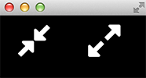

ofxFontAwesome
===

Simple list of constants to use [FontAwesome](http://fortawesome.github.io/Font-Awesome/icons/) in OpenFrameworks. 

Includes FontAwesome version 4 and 5. 

# Install Instruction

1. Clone this repo into your addons folder
2. Drag ofxFontAwsome to your project
3. Make sure the ttf files are copied during the build stage. 
    a. OSX: Click on your target, go to Build-Phases, add this to the Run Script phase: 
    `cp -rf ../../../addons/ofxFontAwesome/bin/data/ "$TARGET_BUILD_DIR/$PRODUCT_NAME.app/Contents/Resources"`
    b. Windows: ??
    c. Linux: ??
    d. Alternative: Just drop the ttf in your bin/data folder

# Examples

The examples use [ofxFontStash2](https://github.com/armadillu/ofxFontStash2) to render text.

	#include "ofxFontAwesome.h"; // fa4 + fa5
	#include "ofxFontAwesome4.h"; // fa4 only
	#include "ofxFontAwesome5.h"; // fa5 only
	
	#include "ofxFontStash2.h"
	

	ofxFontStash2 stash;
	
	void ofApp::setup(){
		// each fontawesome version has a constant with the default ttf name
		stash.addFont("fa4", ofxFontAwesome4::filename); // fontawesome 4
		stash.addFont("fa5s", ofxFontAwesome5s::filename); // fontawesome 5, solid icons
		stash.addFont("fa5r", ofxFontAwesome5r::filename); // fontawesome 5, regular icons
	}
	
	void ofApp::draw(){
		ofBackground(0); 
		ofSetColor(255);
		ofxFontStashStyle style; 

		
		style = ofxFontStashStyle("fa4", 12, {255,255,0}); 
		stash.draw( ofxFontAwesome4::compress + "    " + ofxFontAwesome4::expand, style, 50, 100);

		style = ofxFontStashStyle("fa5s", 12, {255,255,0}); 
		stash.draw( ofxFontAwesome5s::align_center + "    " + ofxFontAwesome5s::bath, style, 50, 130);

		style = ofxFontStashStyle("fa5r", 12, {255,255,0}); 
		stash.draw( ofxFontAwesome5r::address_book + "    " + ofxFontAwesome5r::clipboard, style, 50, 160);
	}

Produces the following output: 

FontAwesome 5
-------------

## FontAwesome 4

	#include "ofxFontAwesome5.h"
	#include "ofxFontStash.h"

	ofxFontStash font_regular = nullptr;
	ofxFontStash font_solid = nullptr; 
	
	void ofApp::setup(){
			font.loadFont("fontawesome-webfont.ttf", 100);
	}
	
	void ofApp::draw(){
		ofBackground(0); 
		
		ofSetColor(255);
		font.drawString( ofxFontAwesome::compress + "    " + ofxFontAwesome::expand, 50, 100);
	}
	

Licensing
---

The font itself (fontawesome-webfont.ttf) is licensed under the [SIL OFL1.1](http://scripts.sil.org/cms/scripts/page.php?site_id=nrsi&id=OFL), the "code" is under the [WTFPL](http://www.wtfpl.net/txt/copying/)